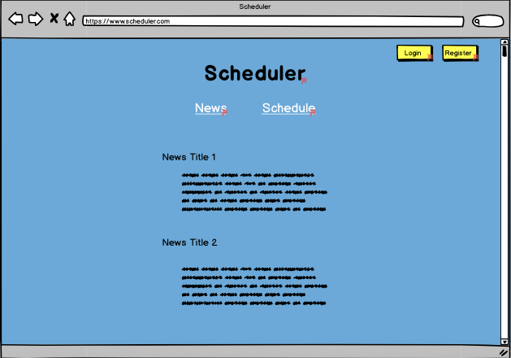
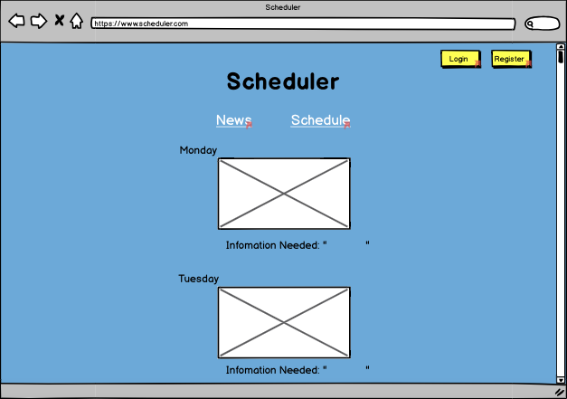
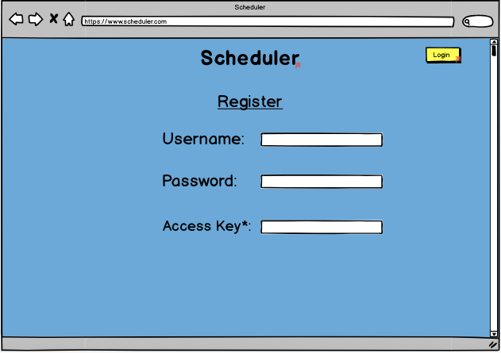
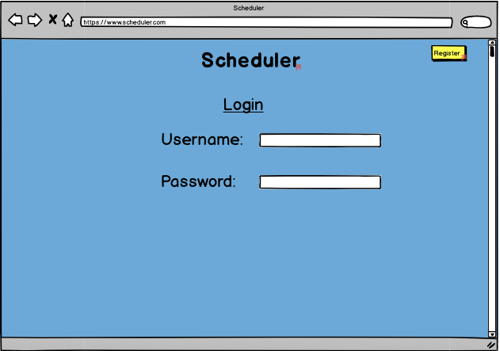
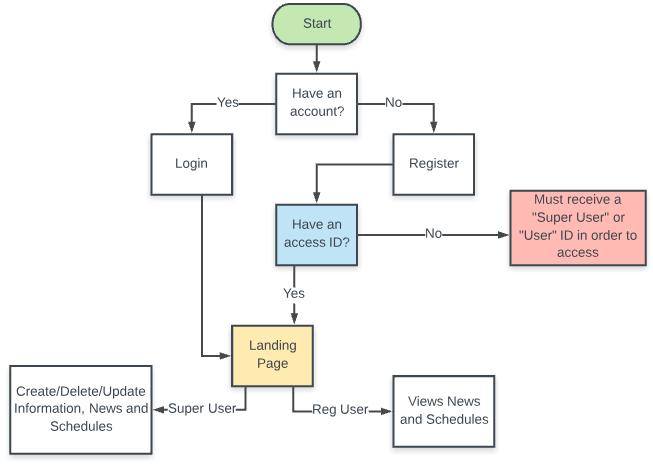
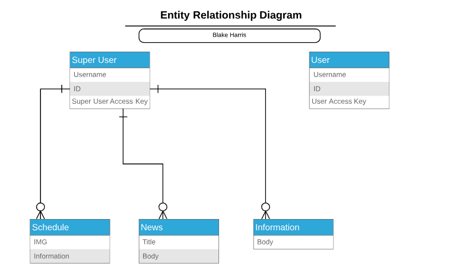

# Scheduler
Scheduler is an app that allows employers to post news and schedules online for their employees to view.

By:
- Blake Harris
---

## Wireframe

---
## Data Flow

---
## ERD

---
## Technologies
- JavaScript
- Node.js
- Express
- React
- MongoDB
- Mongoose

---
## Keys
-To view Scheduler as an ADMIN, enter 1234 as key
-To view Scheduler as a USER, enter 1111 as key

---
## User Stories
-Super User will be able to register with information and a validated SUPERUSER Key

-Super User will be able to perform CRUD operations on photos/descriptions/news for other non-super users to see

-User will be able to register but must have an access key upon registration in order to create an account

-User will then login and be able to see a news page with important information, or a schedule page with the photo's of that weeks schedule

---
## Struggles
-Re-routing users after entering the key. I would switch to react router instead of switch statements due to the browser resetting the state back to the origin state.

-Figuring out the setup of allowing admin to Create/Edit/Delete Schedules or News, while the users can only read them.

-Different setup using Auth0, changes layout of index.js as well ass app.js
